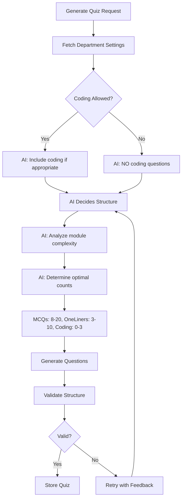

# 🎯 AI-Decided Quiz Structure & Department Controls

## 📋 Overview

The quiz system now features:
1. **AI-Decided Structure** - AI determines the optimal number of MCQs, one-liners, and coding questions
2. **Department-Level Controls** - Companies can enable/disable coding questions per department
3. **Flexible Validation** - Adapts to AI's decisions while maintaining quality standards

---

## ✨ Key Changes

### 1. **AI-Decided Quiz Structure**

**Before:**
- Hardcoded counts: 15 MCQs, 5 One-liners, 2 Coding questions
- Fixed structure regardless of module complexity

**Now:**
- ✅ AI analyzes module content and decides optimal question counts
- ✅ Recommended ranges: MCQs (8-20), One-liners (3-10), Coding (0-3)
- ✅ AI adjusts based on:
  - Module complexity
  - Content depth
  - Training material scope
  - Topic coverage needs

**Example AI Decisions:**
```javascript
// Simple module: "Company Policies"
{
  mcq: 10,
  oneLiners: 4,
  coding: 0  // No coding needed
}

// Complex module: "Advanced React Development"
{
  mcq: 18,
  oneLiners: 8,
  coding: 3  // Includes coding challenges
}
```

---

### 2. **Department-Level Coding Controls**

Companies can now control whether departments use coding questions through Firestore settings.

**Firestore Structure:**
```
freshers/{companyId}/departments/{deptId}/
  ├─ quizSettings: {
  │   ├─ allowCodingQuestions: true|false
  │   └─ updatedAt: timestamp
  │  }
```

**Default Behavior:**
- If no settings exist: `allowCodingQuestions = true`
- AI can include coding questions if appropriate

**When Disabled:**
- AI is explicitly told NOT to include coding questions
- Quiz validation rejects coding questions
- System ensures compliance

---

## 📡 New API Endpoints

### 1. Update Department Settings
```http
PUT /api/company/department/settings
```

**Request Body:**
```json
{
  "companyId": "company-123",
  "deptId": "engineering",
  "quizSettings": {
    "allowCodingQuestions": true
  }
}
```

**Response:**
```json
{
  "success": true,
  "message": "Department quiz settings updated",
  "settings": {
    "allowCodingQuestions": true,
    "updatedAt": "2026-02-13T10:30:00Z"
  }
}
```

**Use Case:**
```bash
# Enable coding questions for Engineering department
curl -X PUT http://localhost:5000/api/company/department/settings \
  -H "Content-Type: application/json" \
  -d '{
    "companyId": "acme-corp",
    "deptId": "engineering",
    "quizSettings": {
      "allowCodingQuestions": true
    }
  }'

# Disable coding questions for HR department
curl -X PUT http://localhost:5000/api/company/department/settings \
  -H "Content-Type: application/json" \
  -d '{
    "companyId": "acme-corp",
    "deptId": "hr",
    "quizSettings": {
      "allowCodingQuestions": false
    }
  }'
```

---

### 2. Get Department Settings
```http
GET /api/company/department/settings?companyId={companyId}&deptId={deptId}
```

**Response:**
```json
{
  "success": true,
  "companyId": "acme-corp",
  "deptId": "engineering",
  "quizSettings": {
    "allowCodingQuestions": true
  }
}
```

---

## 🔄 Quiz Generation Flow

### New Workflow:



### Code Flow:

```javascript
// 1. Fetch department settings
const deptSettings = await getDepartmentSettings(companyId, deptId);
const allowCoding = deptSettings.allowCodingQuestions;

// 2. AI prompt includes department rules
const prompt = buildQuizPrompt({
  title,
  context,
  allowCoding,  // ← Department control
  moduleDescription
});

// 3. AI decides structure
{
  "mcq": [ /* AI decides: 12 questions */ ],
  "oneLiners": [ /* AI decides: 5 questions */ ],
  "coding": [ /* AI decides: 2 questions OR empty if not allowed */ ]
}

// 4. Flexible validation
isQuizComplete(quiz, allowCoding);  // Validates based on department rules
```

---

## 🎨 Frontend Integration Updates

### 1. **Settings UI for Admins**

```jsx
// CompanyDashboard.jsx or DepartmentSettings.jsx
const [allowCoding, setAllowCoding] = useState(true);

const updateQuizSettings = async () => {
  const response = await fetch('/api/company/department/settings', {
    method: 'PUT',
    headers: { 'Content-Type': 'application/json' },
    body: JSON.stringify({
      companyId,
      deptId,
      quizSettings: {
        allowCodingQuestions: allowCoding,
      },
    }),
  });
  
  const result = await response.json();
  if (result.success) {
    showSuccess('Quiz settings updated!');
  }
};

return (
  <div className="quiz-settings">
    <h3>Quiz Configuration</h3>
    <label>
      <input
        type="checkbox"
        checked={allowCoding}
        onChange={(e) => setAllowCoding(e.target.checked)}
      />
      Enable coding questions for this department
    </label>
    <button onClick={updateQuizSettings}>Save Settings</button>
    
    <p className="help-text">
      When enabled, AI may include coding challenges based on module content.
      When disabled, quizzes will only contain MCQs and one-liner questions.
    </p>
  </div>
);
```

---

### 2. **Display AI-Decided Structure**

```jsx
// ModuleQuiz.jsx
const [quizStructure, setQuizStructure] = useState(null);

useEffect(() => {
  // Fetch quiz to see AI-decided structure
  fetch('/api/quiz/generate', {
    method: 'POST',
    body: JSON.stringify({ companyId, deptId, userId, moduleId }),
  })
    .then(res => res.json())
    .then(quiz => {
      setQuizStructure({
        mcqCount: quiz.mcq.length,
        oneLinerCount: quiz.oneLiners.length,
        codingCount: quiz.coding?.length || 0,
        aiDecided: true,
      });
    });
}, [moduleId]);

return (
  <div className="quiz-info">
    <h2>Quiz Structure (AI-Optimized)</h2>
    <div className="structure-breakdown">
      <div className="stat">
        <span className="label">MCQ Questions:</span>
        <span className="value">{quizStructure?.mcqCount}</span>
      </div>
      <div className="stat">
        <span className="label">One-liner Questions:</span>
        <span className="value">{quizStructure?.oneLinerCount}</span>
      </div>
      {quizStructure?.codingCount > 0 && (
        <div className="stat">
          <span className="label">Coding Challenges:</span>
          <span className="value">{quizStructure?.codingCount}</span>
        </div>
      )}
    </div>
    <p className="ai-note">
      🤖 Question counts optimized by AI based on module complexity
    </p>
  </div>
);
```

---

## 🔧 Technical Implementation Details

### Modified Files:

#### 1. **QuizController.js**
- Removed hardcoded `QUIZ_COUNTS`
- Added `getDepartmentSettings()` function
- Updated `isQuizComplete()` to accept `allowCoding` parameter
- Modified `buildQuizPrompt()` to let AI decide structure
- Updated `critiqueQuiz()` for flexible validation
- Changed `shapeQuizPayload()` to not slice AI's decisions

#### 2. **New: updateDepartmentSettings.js**
- Handles department quiz configuration
- CRUD operations for quiz settings
- Validation and defaults

#### 3. **companyRoutes.js**
- Added `/department/settings` endpoints

---

## 📊 AI Prompt Changes

### Before:
```
Generate exactly 15 MCQs and 5 one-liner questions.
```

### Now:
```
AI-DECIDED STRUCTURE: YOU decide the optimal number of questions based on:
- Module complexity and scope
- Content depth from training materials
- Recommended ranges: MCQs (8-20), One-liners (3-10), Coding (0-3 if allowed)
- Adjust counts to ensure comprehensive coverage without overwhelming
```

**AI Considerations:**
1. Simple topics → Fewer questions (e.g., 8 MCQs, 3 One-liners)
2. Complex topics → More questions (e.g., 18 MCQs, 10 One-liners)
3. Technical modules + Coding Allowed → Include coding (1-3 questions)
4. Non-technical OR Coding Disabled → Skip coding entirely

---

## 🎯 Examples

### Example 1: Engineering Department (Coding Enabled)

**Module:** "React State Management"

**Department Setting:**
```json
{ "allowCodingQuestions": true }
```

**AI Decision:**
```json
{
  "mcq": 15,           // ← AI decided
  "oneLiners": 7,      // ← AI decided
  "coding": 2          // ← AI decided (allowed)
}
```

---

### Example 2: HR Department (Coding Disabled)

**Module:** "Employee Onboarding Procedures"

**Department Setting:**
```json
{ "allowCodingQuestions": false }
```

**AI Decision:**
```json
{
  "mcq": 12,           // ← AI decided
  "oneLiners": 5,      // ← AI decided
  "coding": []         // ← Empty (not allowed)
}
```

---

### Example 3: Engineering Department (Non-coding Module)

**Module:** "Agile Methodology Basics"

**Department Setting:**
```json
{ "allowCodingQuestions": true }
```

**AI Decision:**
```json
{
  "mcq": 10,           // ← AI decided
  "oneLiners": 4,      // ← AI decided
  "coding": []         // ← AI chose not to include (topic doesn't need it)
}
```

---

## 🔐 Validation Rules

### Flexible Validation:

```javascript
function isQuizComplete(quiz, allowCoding) {
  // Minimum: 5 MCQs, 2 One-liners
  // Maximum: 25 MCQs, 15 One-liners, 5 Coding (if allowed)
  
  if (quiz.mcq.length < 5 || quiz.mcq.length > 25) return false;
  if (quiz.oneLiners.length < 2 || quiz.oneLiners.length > 15) return false;
  
  // If coding exists but not allowed, reject
  if (quiz.coding?.length > 0 && !allowCoding) return false;
  
  // If coding allowed, max 5 questions
  if (allowCoding && quiz.coding?.length > 5) return false;
  
  return true;
}
```

---

## 📝 Database Schema

### Department Settings Document:

```javascript
freshers/{companyId}/departments/{deptId}
{
  name: "Engineering",
  deptId: "engineering",
  quizSettings: {
    allowCodingQuestions: true,
    // Future settings:
    // minPassThreshold: 70,
    // maxAttempts: 3,
    // allowRetakes: true,
    updatedAt: Timestamp
  },
  // ... other fields
}
```

---

## 🚀 Testing Guide

### Test 1: Enable Coding Questions
```bash
# Step 1: Enable coding for department
curl -X PUT http://localhost:5000/api/company/department/settings \
  -H "Content-Type: application/json" \
  -d '{
    "companyId": "test-company",
    "deptId": "engineering",
    "quizSettings": { "allowCodingQuestions": true }
  }'

# Step 2: Generate quiz for coding module
curl -X POST http://localhost:5000/api/quiz/generate \
  -H "Content-Type: application/json" \
  -d '{
    "companyId": "test-company",
    "deptId": "engineering",
    "userId": "user123",
    "moduleId": "module-js",
    "moduleTitle": "JavaScript Programming"
  }'

# Expected: Quiz includes coding questions (AI decides count)
```

---

### Test 2: Disable Coding Questions
```bash
# Step 1: Disable coding for department
curl -X PUT http://localhost:5000/api/company/department/settings \
  -H "Content-Type: application/json" \
  -d '{
    "companyId": "test-company",
    "deptId": "hr",
    "quizSettings": { "allowCodingQuestions": false }
  }'

# Step 2: Generate quiz
curl -X POST http://localhost:5000/api/quiz/generate \
  -H "Content-Type: application/json" \
  -d '{
    "companyId": "test-company",
    "deptId": "hr",
    "userId": "user456",
    "moduleId": "module-policies",
    "moduleTitle": "Company Policies"
  }'

# Expected: Quiz has NO coding questions, only MCQs and one-liners
```

---

### Test 3: AI Structure Variability
```bash
# Generate quiz for simple module
curl -X POST http://localhost:5000/api/quiz/generate \
  -d '{ ..., "moduleTitle": "Basic Email Etiquette" }'

# Expected: Fewer questions (e.g., 8 MCQs, 3 One-liners)

# Generate quiz for complex module
curl -X POST http://localhost:5000/api/quiz/generate \
  -d '{ ..., "moduleTitle": "Advanced System Architecture" }'

# Expected: More questions (e.g., 18 MCQs, 9 One-liners, 2 Coding)
```

---

## 📈 Benefits

### 1. **Flexibility**
- ✅ Quiz adapts to module complexity
- ✅ No one-size-fits-all approach
- ✅ AI optimizes for learning outcomes

### 2. **Department Control**
- ✅ Companies decide coding requirements per department
- ✅ HR gets concept-focused quizzes
- ✅ Engineering gets technical assessments

### 3. **Better Assessment**
- ✅ Simple modules → Concise quizzes
- ✅ Complex modules → Comprehensive coverage
- ✅ Appropriate challenge level

### 4. **Maintainability**
- ✅ No hardcoded constants to update
- ✅ AI evolves with content
- ✅ Settings managed through API

---

## 🔮 Future Enhancements

1. **Additional Department Settings:**
   - Minimum pass threshold per department
   - Max attempts customization
   - Quiz time limits
   - Question difficulty preferences

2. **Advanced AI Controls:**
   - Preferred question ratios
   - Domain-specific question types
   - Adaptive difficulty based on user performance

3. **Analytics:**
   - Track AI's quiz structure decisions
   - Analyze effectiveness of different structures
   - Optimize AI prompts based on outcomes

---

## 📄 Migration Guide

### For Existing Systems:

1. **Database Migration:**
   ```javascript
   // No migration needed - default behavior (allowCoding=true) matches old behavior
   // Optionally, set explicit settings for departments:
   ```

2. **Frontend Migration:**
   - Quiz display components automatically adapt to AI-decided counts
   - Add department settings UI for admins
   - Update quiz info displays to show actual counts

3. **Testing:**
   - Verify quizzes generate with reasonable counts
   - Test department coding controls
   - Validate quiz submission with variable structures

---

**Implementation Complete! 🎉**

The system now features AI-decided quiz structures with department-level coding question controls, providing maximum flexibility and adaptability.
